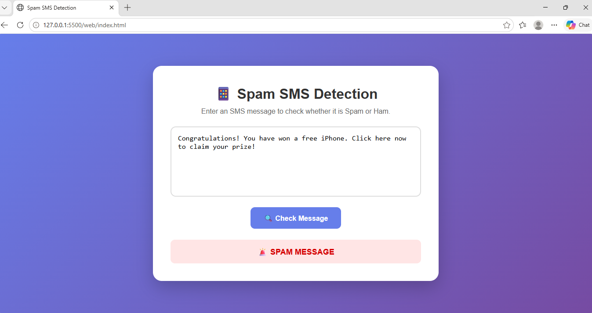

# 📱 Spam SMS Detection

A Machine Learning based web application that detects whether an SMS message is **Spam** or **Ham (Not Spam)**.

The project uses **TF-IDF Vectorization** and **Logistic Regression** to classify SMS messages. A **Flask backend** connects the trained machine learning model with a simple web interface.

---

## 📌 Project Overview

Spam messages are unwanted messages that may contain advertisements, scams, fraudulent offers, or suspicious links.

This project uses Machine Learning to automatically analyze an SMS message and classify it as:

* 🚨 **SPAM**
* ✅ **HAM (Not Spam)**

The trained model is integrated into a web application where users can enter an SMS message and receive a prediction with a confidence percentage.

---

## 🎯 Objective

The main objectives of this project are:

* Detect spam SMS messages automatically
* Apply Machine Learning for text classification
* Use TF-IDF to convert text into numerical features
* Train a Logistic Regression classification model
* Provide a simple web interface for users
* Display prediction confidence
* Build a complete Machine Learning + Flask web application

---

## 🛠️ Technologies Used

### Programming Language

* Python
* HTML
* CSS
* JavaScript

### Machine Learning

* Scikit-learn
* Pandas
* NumPy
* TF-IDF Vectorization
* Logistic Regression

### Backend

* Flask
* Flask-CORS

### Model Storage

* Joblib

### Development Tools

* Visual Studio Code
* Git
* GitHub

---

## 🤖 Machine Learning Approach

The project follows these steps:

```text
SMS Dataset
     ↓
Data Loading
     ↓
Text Preprocessing
     ↓
TF-IDF Vectorization
     ↓
Train-Test Split
     ↓
Logistic Regression
     ↓
Model Evaluation
     ↓
Save Trained Model
     ↓
Flask Backend
     ↓
Web Application
     ↓
Spam / Ham Prediction
```

---

## 📊 Dataset

The project uses the **SMS Spam Collection Dataset**.

Dataset source:

**UCI Machine Learning Repository**

The dataset contains:

* **5,572 SMS messages**
* **4,825 Ham messages**
* **747 Spam messages**

The dataset is divided into training and testing data.

### Dataset Distribution

```text
Total Messages : 5572

Ham Messages   : 4825
Spam Messages  : 747
```

---

## 🧠 Model

The project uses:

### TF-IDF Vectorizer

TF-IDF (Term Frequency-Inverse Document Frequency) converts SMS text into numerical features that can be processed by the Machine Learning model.

Configuration used:

```python
TfidfVectorizer(
    lowercase=True,
    stop_words="english",
    max_features=5000
)
```

### Logistic Regression

Logistic Regression is used as the classification algorithm to predict whether a message is spam or ham.

Configuration:

```python
LogisticRegression(max_iter=1000)
```

---

## 📈 Model Performance

The model was evaluated using a separate test dataset.

### Accuracy

**97.04%**

### Classification Report

```text
              precision    recall  f1-score   support

         Ham       0.97      1.00      0.98       966
        Spam       1.00      0.78      0.88       149

    accuracy                           0.97      1115
   macro avg       0.98      0.89      0.93      1115
weighted avg       0.97      0.97      0.97      1115
```

### Confusion Matrix

```text
[[966   0]
 [ 33 116]]
```

The model correctly classified most of the test messages, achieving an overall accuracy of **97.04%**.

---

## 🔍 Example Predictions

### Example 1

Input:

```text
Congratulations! You have won a free iPhone. Click here now to claim your prize!
```

Output:

```text
🚨 Result: SPAM
```

---

### Example 2

Input:

```text
Hey, are you coming to college tomorrow?
```

Output:

```text
✅ Result: HAM (Not Spam)
```

---

# 🌐 Web Application

The project includes a web-based interface where users can enter an SMS message and check whether it is spam.

The frontend communicates with the Flask backend using an HTTP POST request.

### Backend API

```text
POST /predict
```

The backend receives:

```json
{
    "message": "Congratulations! You won a prize!"
}
```

And returns a response containing:

```json
{
    "prediction": "SPAM",
    "confidence": 76.64
}
```

---

## ✨ Web Application Features

* Enter an SMS message through the web interface
* Send the message to the Flask backend
* Use the trained machine learning model for prediction
* Display the result as SPAM or HAM
* Display prediction confidence percentage
* Visualize confidence using a progress bar
* Character limit of 500 characters
* Responsive and user-friendly interface

---

## 🔄 Web Application Workflow

```text
User enters SMS
       ↓
Click "Check Message"
       ↓
JavaScript sends request
       ↓
Flask Backend
       ↓
Trained ML Model
       ↓
Prediction + Confidence
       ↓
Result displayed on Web Page
```

---

## ▶️ Run the Web Application

### 1. Activate Virtual Environment

Open PowerShell inside the project folder:

```powershell
.\venv\Scripts\activate
```

### 2. Start Flask Backend

Run:

```powershell
python app.py
```

The backend will run at:

```text
http://127.0.0.1:5000
```

### 3. Open the Web Application

Open:

```text
web/index.html
```

in your browser.

Enter an SMS message and click:

```text
🔍 Check Message
```

The application will display:

* Prediction
* Confidence percentage
* Visual confidence bar

---

# 🗂️ Project Structure

```text
Spam SMS Detection
│
├── dataset
│   └── SMSSpamCollection
│
├── model
│   └── spam_classifier.pkl
│
├── screenshots
│   └── spam-detection-demo.png
│
├── web
│   ├── index.html
│   ├── script.js
│   └── style.css
│
├── venv
│
├── app.py
├── train_model.py
├── predict.py
├── requirements.txt
├── README.md
└── .gitignore
```

---

# ⚙️ How to Run

### Step 1 — Clone the Repository

```bash
git clone https://github.com/subashinisselvem/Spam-SMS-Detection.git
```

### Step 2 — Open the Project

```bash
cd Spam-SMS-Detection
```

### Step 3 — Create Virtual Environment

```bash
python -m venv venv
```

### Step 4 — Activate Virtual Environment

```powershell
.\venv\Scripts\activate
```

### Step 5 — Install Dependencies

```bash
pip install -r requirements.txt
```

### Step 6 — Train the Model

```bash
python train_model.py
```

This creates:

```text
model/spam_classifier.pkl
```

### Step 7 — Run the Flask Application

```bash
python app.py
```

### Step 8 — Open the Web Interface

Open:

```text
web/index.html
```

in your browser.

---

## 📦 Requirements

The main Python libraries used are:

```text
pandas
numpy
scikit-learn
matplotlib
seaborn
joblib
Flask
flask-cors
```

They can be installed using:

```bash
pip install -r requirements.txt
```

---

## 📸 Project Screenshots



---

## 🚀 Future Improvements

* Improve spam recall
* Add more training data
* Try additional machine learning algorithms
* Improve the user interface
* Deploy the web application online
* Add support for multiple languages
* Explore real-time SMS classification

---

## 📌 Project Status

**Completed ✅**

The machine learning model has been trained and tested successfully with an accuracy of **97.04%**.

The project also includes a working **Flask backend and web-based SMS spam detection interface**.
